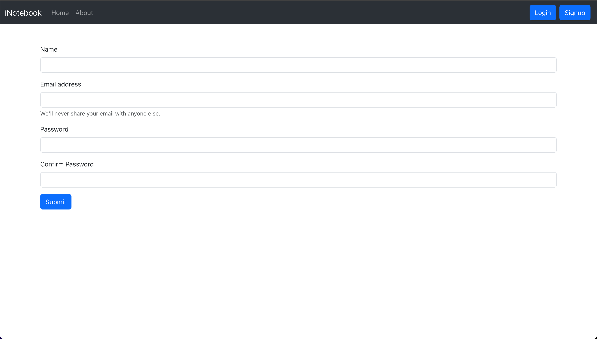
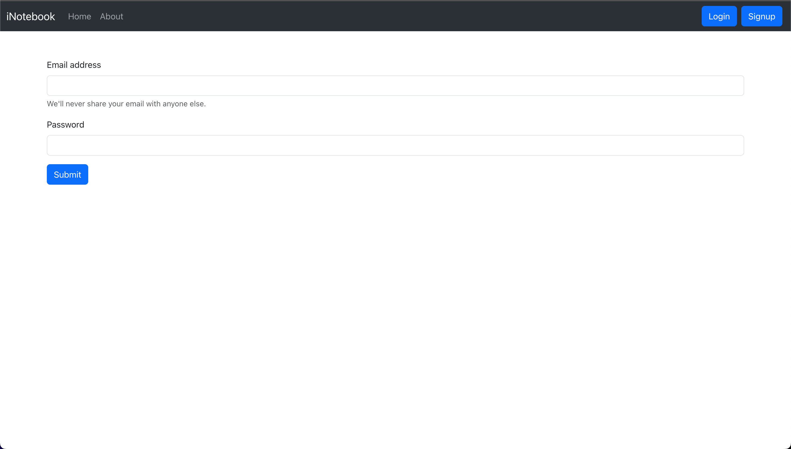
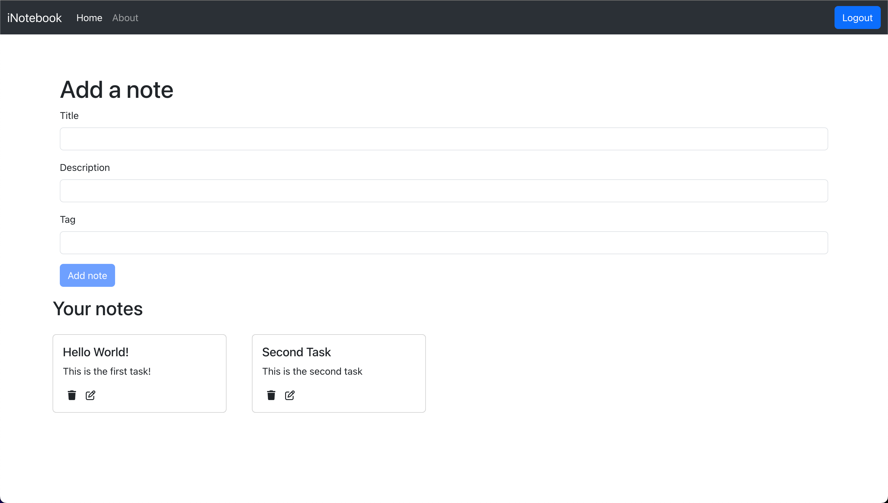
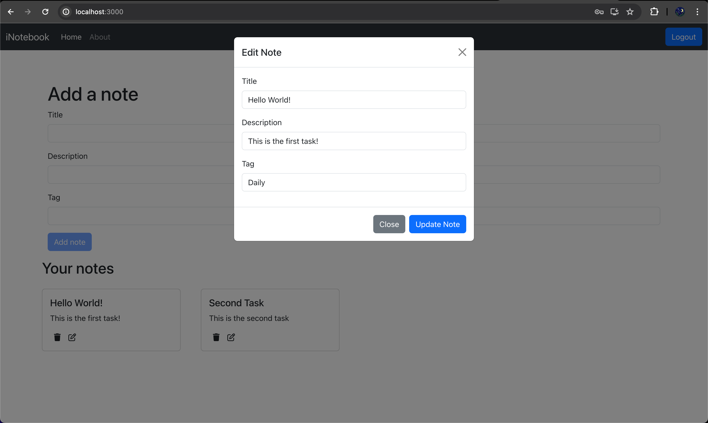
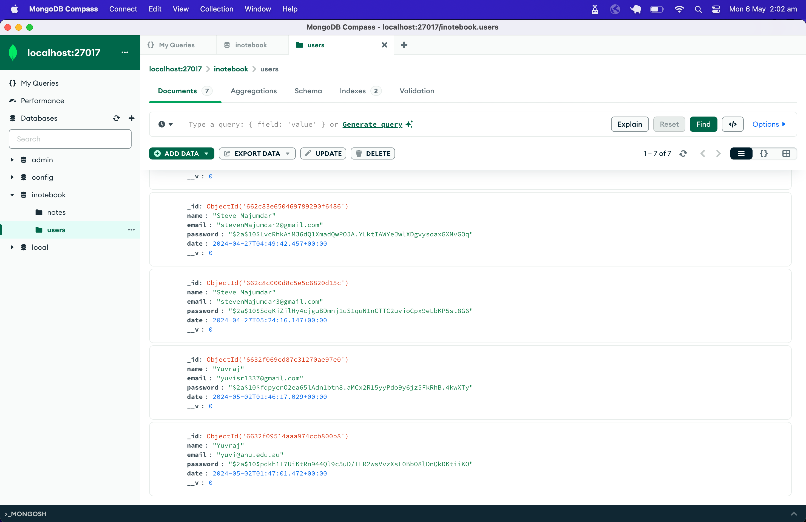
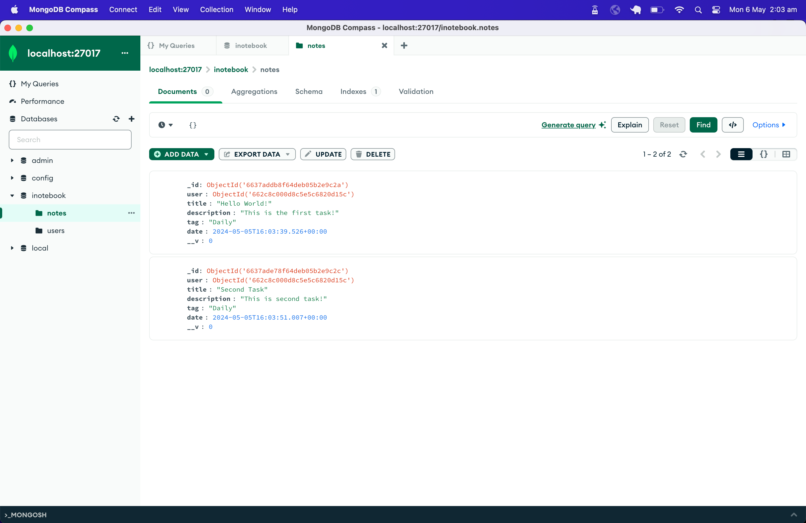

# iNotebook

A MERN Stack based application that has the following functionalities:
- Creating a User.
- User Login and Authentication using JWT Token.
- Create Notes with title, description and tags.
- Stores the notes in MongoDB database.
- Let you edit or delete an existing note.

## Technologies Used

- **Frontend:** React, HTML, CSS, Bootstrap
- **Backend:** Node.js, Express.js, mongoose
- **Database:** MongoDB

## Installation

Download / Clone the repository using command:
```bash
git clone git@github.com:yuviii99/cloud-notebook.git
```

Change the current directory to the repo directory:
```bash
cd cloud-notebook
```

Install required packages:
```bash
npm install
```

Setup your MongoDB database and update `mongoURI` inside [db.js](https://github.com/yuviii99/cloud-notebook/blob/master/backend/db.js).
```code
const mongoURI = [YOUR_DATABASE_URI];
```

Start the application by running the following command in the `cloud-notebook` directory:
```bash
npm run both
```
This command will automatically start the backend node.js server and the React app.

## Features

### Signup Screen



### Login Screen



### Add Note



### Update Note



### MongoDB Users Database

The password for users is stored in hash format using JWT secret and salt.



### MongoDB Notes Database

The notes are stored along with the id of the user that created them. This helps to ensure that notes created by other users are not
visible to the current logged in user.

